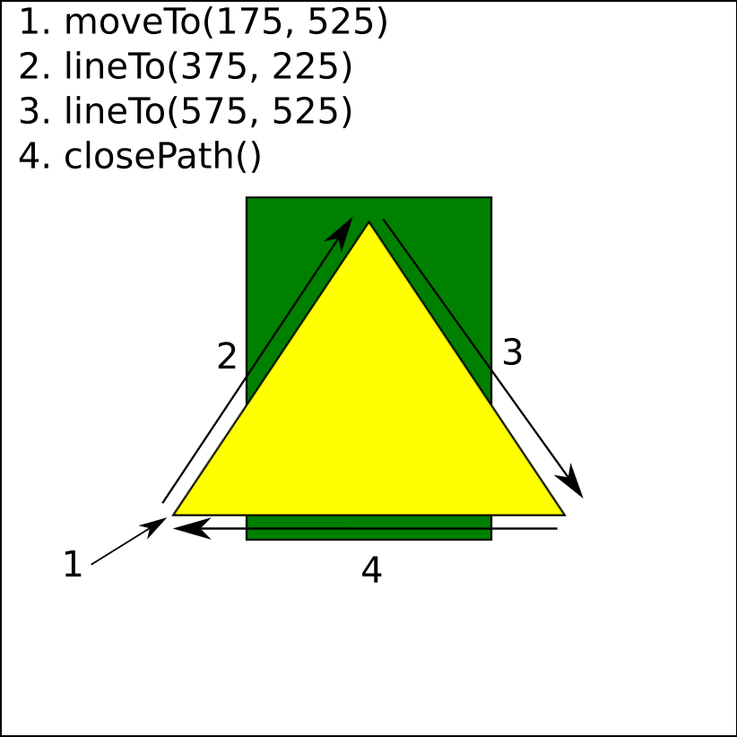
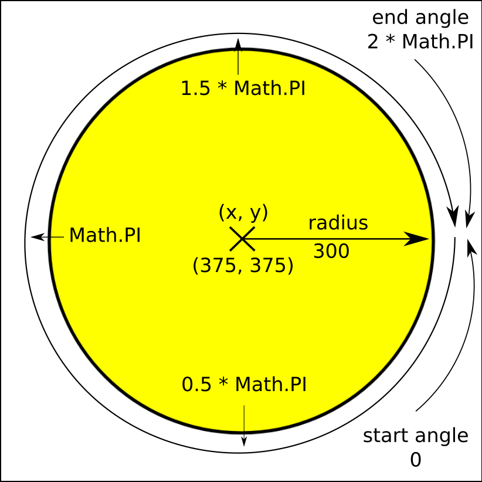
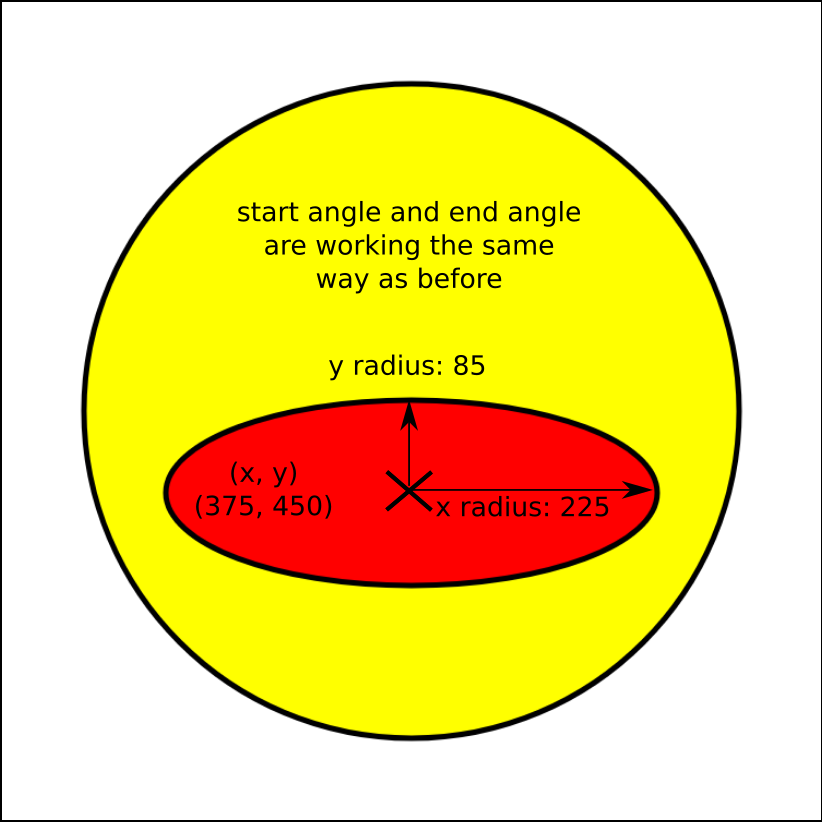
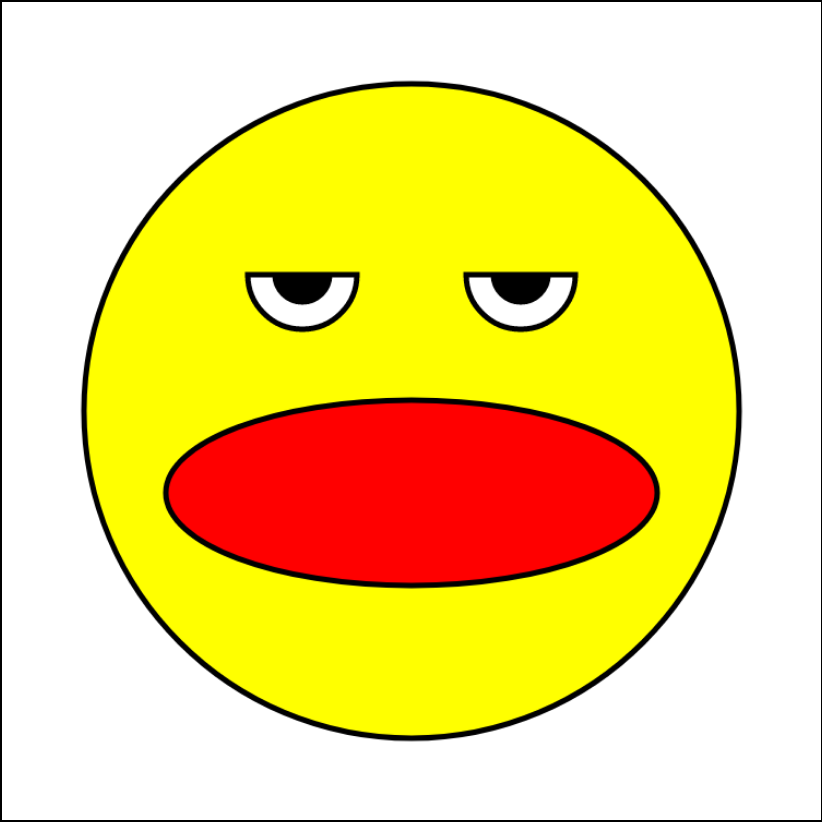

# Canvas Tutorial: Draw a Picture

## Canvas in HTML

In this tutorial, you'll be using HTML5 `canvas` to draw images onto the screen.  Here's what a `canvas element` looks like in the html:

```html
<canvas width="750" height="750"></canvas>
```

With `canvas` you give the element `width` and `height` attributes in the html, instead of the `css`.  By default, a `canvas` element has a `width` of 300 pixels and a `height` of 150 pixels.

## Canvas in JavaScript

First you need to get the JavaScript to recognize the `canvas` element, like you would other HTML elements, using ```document.querySelector```.
```javascript
let cnv = document.querySelector('canvas')
```
But you also need to define a new variable, the `context` with which you'll be drawing on the canvas.
```javascript
let ctx = cnv.getContext('2d')
```
It's a good idea to store your canvas height and width as variables.
```javascript
let w = 750
let h = 750
```

# Simple Shapes: Rectanges and Lines

## Drawing a Rectangle with ctx.rect()

[MDN Docs for ctx.rect()](https://developer.mozilla.org/en-US/docs/Web/API/CanvasRenderingContext2D/rect)

Let's draw a rectangle using the `rect` method.
```javascript
// ctx.rect takes in the starting coordinates and dimensions of a rectangle
ctx.rect(250, 200, 250, 350) // ctx.rect(x, y, width, height)

// but nothing is drawn until you use another method like fill
ctx.fillStyle = 'green' // fillstyle is an property of ctx; it can be a color, gradient, or pattern and is 'black' by default
ctx.fill() // fill() is a method; this line of code draws the green rectangle

// or stroke
ctx.lineWidth = 2 // lineWidth is also an property of ctx; it takes a number and is 1 by default
ctx.stroke() // stroke() is a method; this line of code draws the black outline of the green rectangle
```


## Drawing a Triangle with Path

[MDN Docs for ctx.beginPath()](https://developer.mozilla.org/en-US/docs/Web/API/CanvasRenderingContext2D/beginPath)

[MDN Docs for ctx.moveTo()](https://developer.mozilla.org/en-US/docs/Web/API/CanvasRenderingContext2D/moveTo)

[MDN Docs for ctx.lineTo()](https://developer.mozilla.org/en-US/docs/Web/API/CanvasRenderingContext2D/lineTo)

[MDN Docs for ctx.closePath()](https://developer.mozilla.org/en-US/docs/Web/API/CanvasRenderingContext2D/closePath)

Now let's draw triangle inside the rectangle with a `path`.
```javascript
ctx.beginPath() // first, call beginPath() to start a new path
ctx.moveTo(175, 525) // imagine the path is being drawn by a pencil; moveTo says pick up the pencil and put it down here, at these (x, y) coordinates
ctx.lineTo(375, 225) // lineTo says draw a straight line from the previous coordinates to this point
ctx.lineTo(575, 525) // then to this point
ctx.closePath() // finally, closePath will draw a line back to where we started
ctx.fillStyle = 'yellow'
ctx.fill()
ctx.stroke()
```



# Drawing a Smiley? with Arc and Ellipse

## Drawing a Circle With ctx.arc()

[MDN Docs for ctx.arc()](https://developer.mozilla.org/en-US/docs/Web/API/CanvasRenderingContext2D/arc)

Now, on a new canvas we can draw a perfect circle with `arc`.  Let's use it to draw the face.
```javascript
// ctx.arc takes in the dimensions of a circle
// ctx.arc(x, y, radius, start angle, end angle)
ctx.arc(375, 375, 300, 0, 2 * Math.PI)
// x and y are the center of the arc
// the radius is a vector from (x, y) to the starting point of the arc
// the start and end angle are in radians
// 360° = 2 * π in radians
ctx.fillstyle = 'yellow' // let's give it a yellow face
ctx.fill() // fill in the yellow
ctx.lineWidth = 5 // let's give it a thick outline
ctx.stroke() // stroke the outline of the face
```


## Drawing an Ellipse with ctx.ellipse()

[MDN Docs for ctx.ellipse()](https://developer.mozilla.org/en-US/docs/Web/API/CanvasRenderingContext2D/ellipse)

Let's give this face a mouth with `ellipse`, which can create longer round shapes.
```javascript
ctx.beginPath() // start a new path from the last arc
// ctx.ellipse() takes in the dimensions of the ellipse
// ctx.ellipse(x, y, x radius, y radius, rotation, start angle, end angle)
ctx.ellipse(375, 450, 225, 85, 0, 0, 2 * Math.PI)
// x and y function the same as in an arc, they are the coordinates of the center of the ellipse
// x radius is the horizontal radius
// y radius is the vertical radius
// rotation (radians) can be used to tilt the ellipse (we're not tilting the ellipse by using 0)
// start and end angle (radians) function the same as in an arc
ctx.fillStyle = 'red' // this is the mouth, so let's make it red
ctx.fill()
ctx.stroke()
```


## Create a Function to Draw Eyes

We need to draw two eyes, so we can save some time by writing a `function` we can use twice.

```javascript
function drawEye(xPos) { // the eyes will be the exact same except for the x-coordinate, so lets give this function an xPos parameter

    // eyeball
    ctx.beginPath()
    ctx.arc(xPos, 250, 50, 0, Math.PI) // notice this time the end angle value is half what it was before, this will give us a half circle
    ctx.fillStyle = 'white'
    ctx.fill()
    ctx.stroke

    // pupil
    ctx.beginPath()
    ctx.arc(xPos, 250, 25, 0, Math.PI) // another half circle
    ctx.fillStyle = 'black'
    ctx.fill()
    ctx.stroke()
}

drawEye(275) // draw an eye with an xPos of 275
drawEye(475) // draw an eye with an xPos of 475
```

# The Final Product


Cool!  Now it's your turn.

## Version 1

Draw a picture using `ctx.rect()`, `ctx.moveTo()`, `ctx.lineTo()`, `ctx.beginPath()`, and `ctx.closePath()`.

## Version 2

Now add more shapes with `ctx.arc()` and `ctx.ellipse()`.

## Optional

Add animations with [requestAnimationFrame()](https://developer.mozilla.org/en-US/docs/Web/API/window/requestAnimationFrame).
